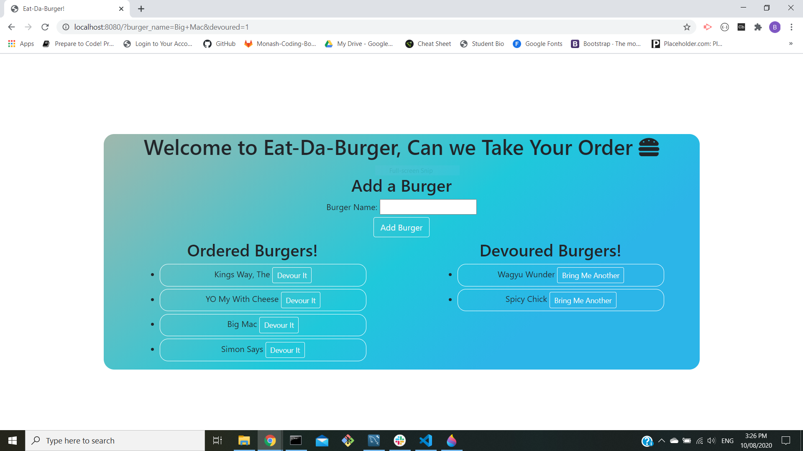

# Eat-Da-Burger  

    

## Description 

An application using mysql, nodejs, handlebars and heroku to give you a website that allows you to enter the names of burgers you want to be displayed on the screen waiting for you to devour them, once the devour button has been pressed its status is updated in the database and the burger is now moved to the devoured list, waiting for you to order is again.

## Links

<a href="https://vast-ocean-16398.herokuapp.com/">Link to Deployed Website on Heroku</a>
<a href="https://ben-j-st.github.io/updated-portfolio/">Link to Portfolio</a>

## Table of Contents

* [Description](#Description)
* [Links] (#Links)
* [Installation](#Installation)
* [Usage](#Usage)
* [Licence](#Licence)
* [Contributing](#Contributing)
* [Tests](#Tests)
* [Questions](#Questions)

## Installation

add later

## Usage

connects to mysql database and inserts new burgers, update the status of old ones and displays the information to the client through handlebars, allowing them to update and add to the database with ease 

## Licence 

MIT

A short and simple permissive license with conditions only requiring preservation of copyright and license notices. Licensed works, modifications, and larger works may be distributed under different terms and without source code. see full licence at https://choosealicense.com/licenses/mit/

## Contributing 

no added help

## Tests

no tests applicable 

## Questions

Github Username: <a href="https://github.com/ben-j-st">ben-j-st</a>

Email: ben_j_stephens@hotmail.com

## Screenshot 

